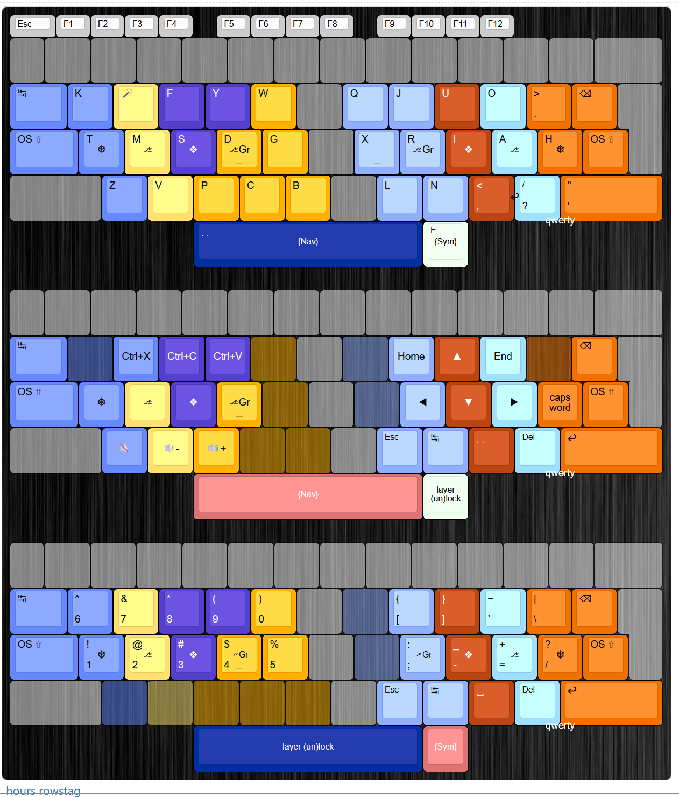

# Hours AKL
Hours, also known as *no-name-yet-but-its-good-also-nokwts-fingering-repeat-with-rules-nl-rn-u_apostrophe-ys*, is an alternate keyboard layout for rowstag keyboards created by zak https://zakventer.com/   

This is my rendition of it for Kanata. The layers and mods are how I prefer them, and the B letter (which is positioned on the qwerty B position which I hate) has been banished to a combo on the top row, which I find much more comfortable.

It utilizes:
• nonstandard fingermap (nokwts, color coded below)
• thumb alpha (E)
• magic with the following rules: nl rn u' ys, else repeat
• nav and sym layers
• mirrored one-shot pinky shifts & home row mods

